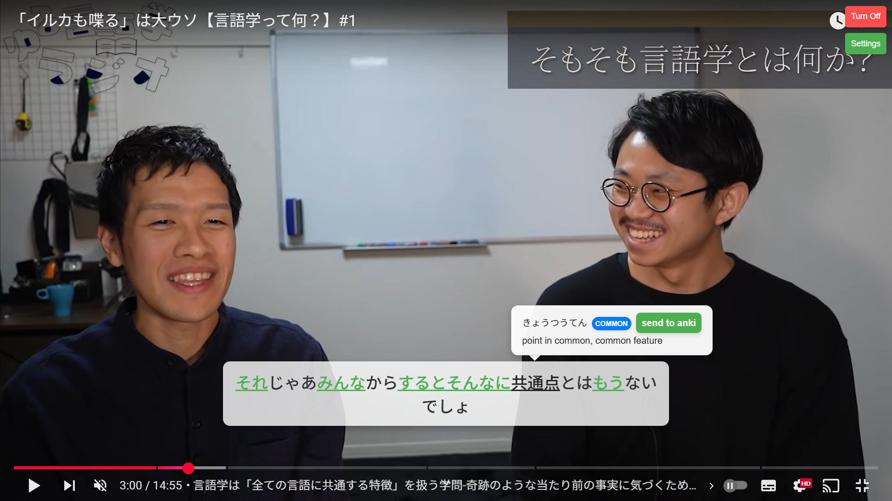
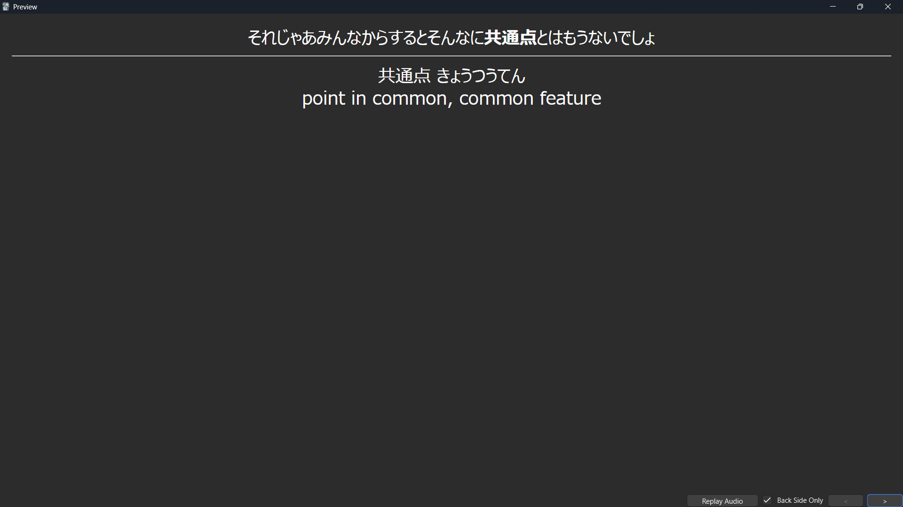

# Kioku （記憶）

Kioku (pronounced: **key** + **oh** + **coo**l) is an automatic Japanese sentence miner which simplifies the process of adding new flashcards into Anki.

It currently supports YouTube and Netflix but more platforms may be added in the future.

## Key Features
- Known word highlighting
- Automatic addition to Anki (sentence cards)
- Popup dictionary

## Motivation
I have been learning Japanese daily for about 2 years and could not find a good free sentence miner. So I made this to help me achieve that and have been mining daily with it ever since.

## Examples

  

  

## Installation

1. **Download the Source Code**
   - Go to `Code > Download ZIP`.
   - Unzip the source code.

2. **Open Chrome Extensions Page**
   - Navigate to `chrome://extensions/` in Google Chrome.

3. **Enable Developer Mode**
   - Toggle the switch labeled **Developer mode** in the top-right corner.

4. **Load Your Extension**
   - Click **Load unpacked**.
   - Select the folder containing the extension’s source files (must include `manifest.json`).

5. **Install the Anki Add-on**
   - Instructions can be found [here](https://github.com/KingGior007/sentence-miner-anki-addon).

## Updating Your Extension
- Make changes in the source folder.
- Click the **Reload** button on the extension’s card in `chrome://extensions/` to apply updates.
